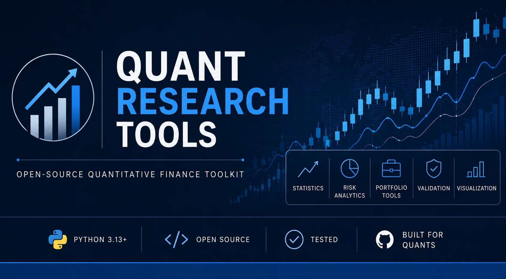

<p align="center">
  
</p>

# Quant Research Tools


Open-source quantitative finance utilities for systematic trading, portfolio analytics, and financial research.

---

# Features

## Performance Metrics

- ✅ Drawdown Series
- ✅ Maximum Drawdown
- ✅ Drawdown Duration
- ✅ CAGR
- ✅ Sharpe Ratio
- ✅ Sortino Ratio
- ✅ Calmar Ratio

## Trade Analytics

- ✅ Profit Factor
- ✅ Expectancy
- ✅ Win Rate
- ✅ Average Win
- ✅ Average Loss
- ✅ Payoff Ratio

## Portfolio Analytics

- ✅ Beta
- ✅ Alpha
- ✅ Active Return
- ✅ Tracking Error
- ✅ Information Ratio
- ✅ Treynor Ratio

## Planned

### Performance Metrics

- Recovery Factor
- Recovery Time
- Volatility

### Risk Metrics

- Value at Risk (VaR)
- Conditional VaR (CVaR)
- Beta
- Alpha

### Portfolio Analytics

- Portfolio Return
- Portfolio Volatility
- Correlation Matrix
- Covariance Matrix

---

# Installation

```bash
git clone https://github.com/bilal-ffs/quant-research-tools.git

cd quant-research-tools

pip install -e .
```

---

# Running Tests

```bash
pytest
```

---

# Project Structure

```text
quant-research-tools/
│
├── quanttools/
│   ├── statistics/
│   ├── portfolio/
│   ├── risk/
│   ├── indicators/
│   ├── utils/
│   └── visualization/
│
├── tests/
├── docs/
├── examples/
└── notebooks/
```

---

# Current Version

**Latest Release:** v0.7.0

---

# Contributing

Contributions are welcome.

Before opening a pull request:

- Run `ruff check . --fix`
- Run `black .`
- Run `pytest`

---
## Backtest API

```python
import pandas as pd

from quanttools import Backtest

returns = pd.Series([...])
trade_results = pd.Series([...])

bt = Backtest(
    returns,
    trade_results,
)

print(bt.summary())
print(bt.report())

df = bt.to_dataframe()

json_data = bt.to_json()

bt.to_csv("summary.csv")
```

# License

MIT License