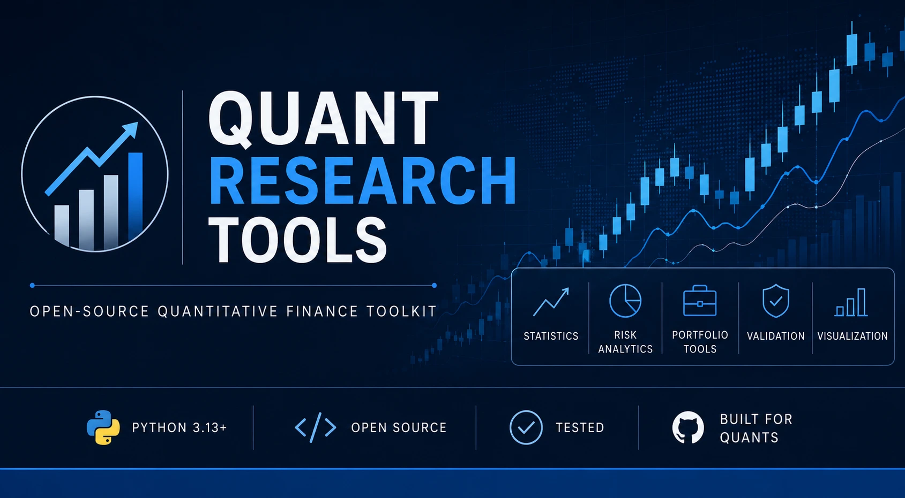

<p align="center">
  
</p>

[](https://www.python.org/)
[](LICENSE)

# Quant Research Tools

Open-source quantitative finance utilities for systematic trading, portfolio analytics, risk analysis, and financial research.

---

## Overview

Quant Research Tools is a Python library for quantitative researchers and systematic traders.

The project provides reusable building blocks for:

- Performance analysis
- Trade analytics
- Portfolio analytics
- Risk analysis
- Backtest reporting

The goal is to provide small, composable, well-tested utilities that can be used independently or combined into a complete research workflow.

---

# Features

## Performance Metrics

- ✅ Drawdown Series
- ✅ Maximum Drawdown
- ✅ Drawdown Duration
- ✅ CAGR
- ✅ Sharpe Ratio
- ✅ Sortino Ratio
- ✅ Calmar Ratio

## Trade Analytics

- ✅ Profit Factor
- ✅ Expectancy
- ✅ Win Rate
- ✅ Average Win
- ✅ Average Loss
- ✅ Payoff Ratio

## Portfolio Analytics

- ✅ Beta
- ✅ Alpha
- ✅ Active Return
- ✅ Tracking Error
- ✅ Information Ratio
- ✅ Treynor Ratio

## Risk Analytics

- ✅ Volatility
- ✅ Downside Deviation
- ✅ Historical Value at Risk (VaR)
- ✅ Conditional Value at Risk (CVaR)
- ✅ Ulcer Index

---

# Backtest API

Quant Research Tools provides a `Backtest` object for combining return data and trade results.

```python
import pandas as pd

from quanttools import Backtest

returns = pd.Series([...])

trade_results = pd.Series([...])

bt = Backtest(
    returns,
    trade_results,
)

print(bt.summary())

print(bt.report())

df = bt.to_dataframe()

json_data = bt.to_json()

bt.to_csv("summary.csv")
```

The Backtest API provides:

- Performance summaries
- Human-readable reports
- DataFrame export
- JSON export
- CSV export

---

# Example

A complete research workflow can combine portfolio and risk analytics with backtest reporting.

```python
import pandas as pd

from quanttools import Backtest
from quanttools.portfolio import (
    alpha,
    beta,
    information_ratio,
)
from quanttools.risk import (
    conditional_value_at_risk,
    value_at_risk,
    volatility,
)

returns = pd.Series([...])

benchmark_returns = pd.Series([...])

trade_results = pd.Series([...])

# Risk
print(
    "Volatility:",
    volatility(returns),
)

print(
    "VaR:",
    value_at_risk(
        returns,
        confidence_level=0.95,
    ),
)

print(
    "CVaR:",
    conditional_value_at_risk(
        returns,
        confidence_level=0.95,
    ),
)

# Portfolio
print(
    "Beta:",
    beta(
        returns,
        benchmark_returns,
    ),
)

print(
    "Alpha:",
    alpha(
        returns,
        benchmark_returns,
    ),
)

print(
    "Information Ratio:",
    information_ratio(
        returns,
        benchmark_returns,
    ),
)

# Backtest
bt = Backtest(
    returns,
    trade_results,
)

print(bt.report())
```

For a complete runnable example, see:

```text
examples/complete_analysis.py
```

---

# Installation

Clone the repository:

```bash
git clone https://github.com/bilal-ffs/quant-research-tools.git

cd quant-research-tools
```

Install in editable mode:

```bash
pip install -e .
```

For development:

```bash
pip install -r requirements-dev.txt
```

---

# Documentation

Build and serve the documentation locally:

```bash
mkdocs serve
```

Build the documentation in strict mode:

```bash
mkdocs build --strict
```

The documentation covers:

- Statistics
- Portfolio Analytics
- Risk Analytics
- Backtest API
- Reports
- Metric definitions
- Mathematical formulas
- Usage examples
- Research workflows

---

# Running Tests

Run the complete test suite:

```bash
pytest
```

The project uses automated testing to validate:

- Statistical metrics
- Trade analytics
- Portfolio analytics
- Risk metrics
- Backtest functionality
- Input validation
- Edge cases
- Public API stability

The suite covers regression, edge cases, API stability and bootstrap reproducibility.

---

# Code Quality

The project uses:

- **Ruff** for linting
- **Black** for formatting
- **Pytest** for testing
- **MkDocs** for documentation

Before submitting changes:

```bash
ruff check . --fix
black .
pytest
mkdocs build --strict
```

---

# Continuous Integration

GitHub Actions validates the project across:

- Python 3.10
- Python 3.11
- Python 3.12
- Python 3.13

CI checks:

- Black formatting
- Ruff linting
- Pytest
- MkDocs strict documentation build

---

# Project Structure

```text
quant-research-tools/
│
├── quanttools/
│   ├── statistics/
│   ├── portfolio/
│   ├── risk/
│   ├── reports/
│   ├── backtest/
│   └── utils/
│
├── tests/
├── docs/
├── examples/
└── notebooks/
```

---

# Current Version

**Latest release: v1.0.0** (package version remains `1.0.0`).

**Latest development on `main`: performance reliability and bootstrap robustness.**
These additions are unreleased; see [CHANGELOG.md](CHANGELOG.md).

The current API includes:

- Performance and trade analytics, portfolio metrics, risk metrics, and reports.
- Corrected drawdowns that include starting equity, plus labeled drawdown episodes
  and recovery time with explicit unrecovered status.
- Configurable annualization and annual risk-free rates for Backtest and reports.
- Consistent benchmark index alignment and finite numeric input validation.
- Reproducible IID and moving-block bootstrap through standalone functions and
  `Backtest.robustness()`, with percentile summaries, valid counts, ending-loss
  probability, and optional equity paths.

Local validation on Python 3.13: **360 tests passed**, Ruff and Black checks passed,
and the strict MkDocs build passed. The synthetic example runs with
`python -m examples.robustness_analysis`. Bootstrap distributions are conditional
on the historical sample, not forecasts; cash trade P&L remains separate from
periodic percentage returns.

---

# Recovery and bootstrap robustness

Backtest and reports accept keyword-only `periods_per_year=252` and
`risk_free_rate=0.0`. The latter is annual and divided by periods per year for
Sharpe and Sortino. Standalone downside deviation, alpha and Treynor retain
**per-period** risk-free-rate inputs.

```python
from quanttools.statistics import drawdown_episodes, recovery_time
from quanttools.validation import iid_bootstrap, moving_block_bootstrap

bt = Backtest(returns, trade_results, periods_per_year=12, risk_free_rate=0.03)
print(drawdown_episodes(returns))
print(recovery_time(returns))  # None if the deepest episode remains unrecovered
result = bt.robustness(method="moving_block", block_size=3, random_state=42)
print(result.summary)  # lower, median, upper percentiles and per-metric valid_count
print(result.probability_of_loss)
```

Standalone bootstrap defaults are 1000 simulations, horizon equal to cleaned
sample length, 95% central percentile bounds, 252 periods/year, annual risk-free
rate 0, and no stored paths. Moving blocks default to block_size=5. Integer seeds
use a local NumPy generator without changing global random state.
`return_paths=True` retains equity paths beginning at 1.0. Undefined metrics stay
NaN in per-simulation results, with valid counts; whole paths are not discarded.
Summary and reports never run bootstrap unless robustness is requested separately.

Drawdown includes starting capital as the initial high-water mark: returns
`[-0.10, 0.05]` have drawdowns `[-0.10, -0.055]`. Recovery means reaching or exceeding
the previous peak. Episodes preserve labels, count observations, and mark open
recoveries explicitly. A -100% return makes compounded equity permanently zero;
returns below -100% are rejected. Cash trade P&L stays separate from returns.
Paired benchmark metrics require matching unique index labels, reorder by label,
and remove missing pairs jointly; unrelated observations are never compared.

Blocks preserve some local dependence within each block. Simulated distributions
are conditional on the historical sample, **not forecasts**, and cannot introduce
unseen regimes or losses. They do not select strategies or an optimal block size.

Run a complete synthetic example from the repository root:

```bash
python -m examples.robustness_analysis
```

See [bootstrap documentation](docs/validation.md),
[recovery analysis](docs/drawdown.md), [metric conventions](docs/conventions.md),
and [intentional corrections and release notes](CHANGELOG.md).

---

# Roadmap

## Performance

- Recovery Factor

## Portfolio

- Correlation Matrix
- Covariance Matrix

## Future

- Visualization tools
- Additional quantitative research utilities
- Expanded backtest functionality
- Additional portfolio analytics

Future additions will aim to maintain compatibility with the stable v1.0 API.

---

# Contributing

Contributions are welcome.

Before opening a pull request, make sure:

```bash
ruff check . --fix
black .
pytest
mkdocs build --strict
```

Please open an issue before submitting large architectural changes.

---

# License

MIT License